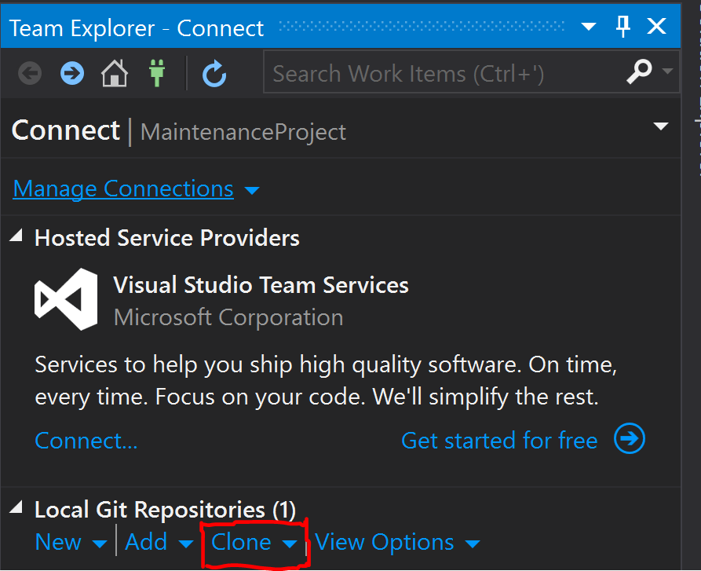
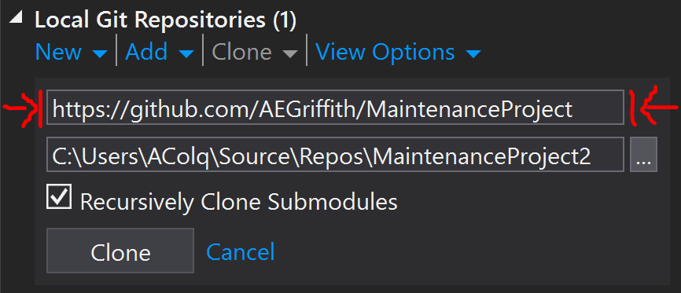
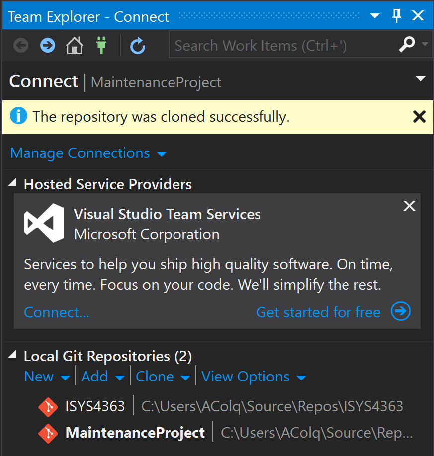
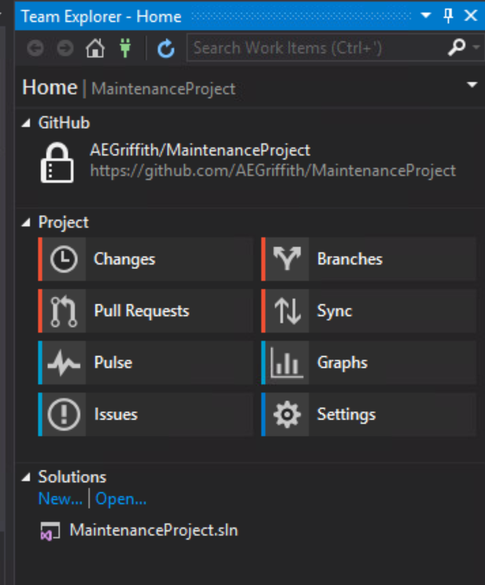
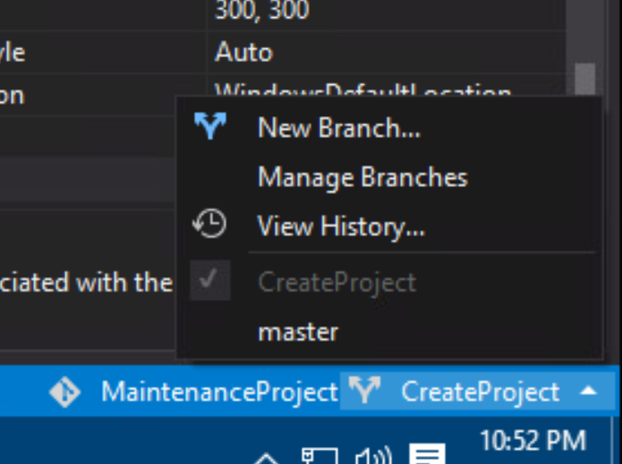
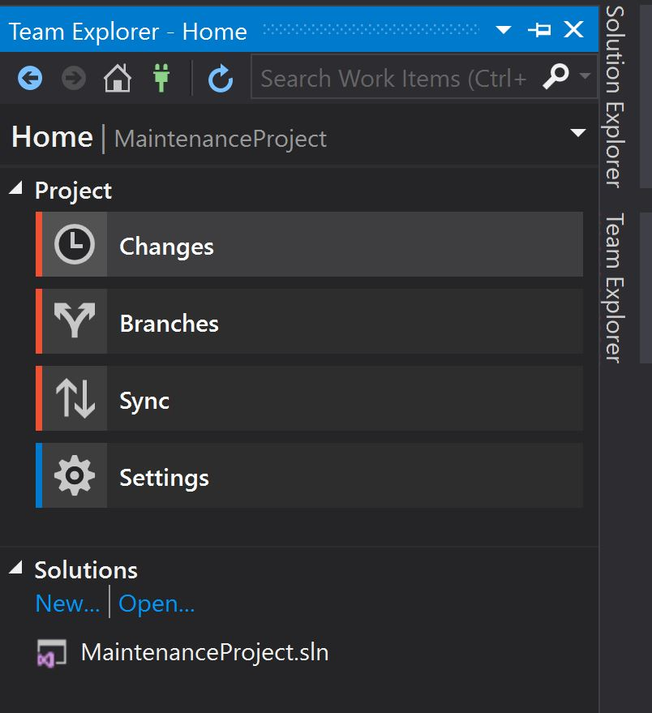
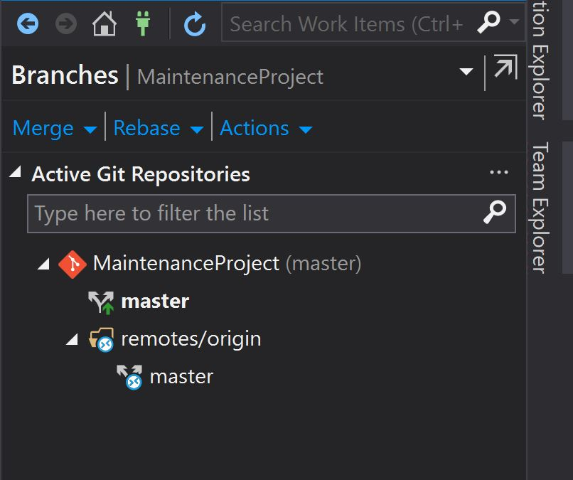
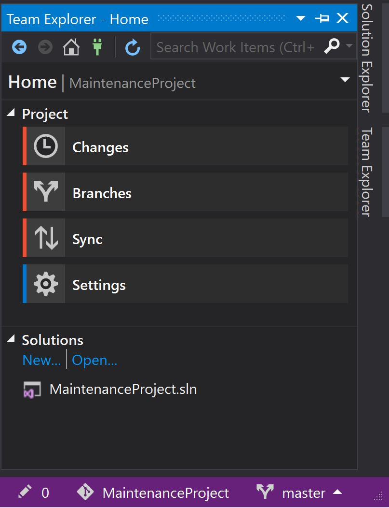

# MaintenanceProject
ISYS 4363 Maintenance Project

###Getting Started
To get familiar with GitHub, please follow this guide:
[Getting Started](https://guides.github.com/activities/hello-world/) 

It covers the topics:
* Create and use a repository
* Start and manage a new branch
* Make changes to a file and push them to GitHub as commits
* Open and merge a pull request

---
###How to Use With Visual Studio
You are able to use this with Visual Studio. It's already installed on the school computers. Here is an overview of using 
[GitHub with Visual Studio](https://visualstudio.github.com/)

---
###Access the Project from Visual Studio
* Open Visual Studio
* Open the **Team Explorer Window**
* Click the *Clone* option.

* In the first textbox enter the link to the repository. 
* *https://github.com/AEGriffith/MaintenanceProject*

* The second box is where it will be located on your computer. 
* Click the *Clone* button. 
* You should get a message saying that the repository was clones successfully.
* You should also be able to see it under your *Local Git Repositories* section.

* Click the Repository.
* You will see this screen.

* Open the solution file to work on the project.
* *It is very important to take note of the branch you are working on*
* You can see or change the branch you are working on from the bottom right of Visual Studio.

* New branches can also be created from here.

---
###Create New Branch

* In the Team Explorer window, select Branches

* Select Master (**NOTE: DO NOT SELECT the remotes/origin master**)

  * This can also be done by selecting the master branch from the menu at the bottom of Visual Studio.

* Click the home button.
* Click Sync

* 

